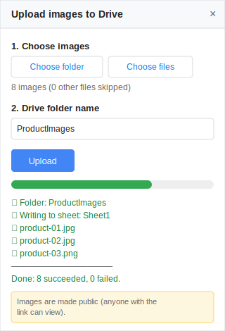

# Add-on Google Sheet: Upload ảnh → Drive (public) → Metadata vào Sheet

Chọn một thư mục ảnh trên máy, add-on sẽ:
1. Upload toàn bộ ảnh lên một **folder mới trên Google Drive**
2. Đặt tất cả ảnh ở chế độ **public** (ai có link đều xem được)
3. Ghi **metadata** của từng ảnh vào Google Sheet hiện tại

Giao diện **song ngữ Anh/Việt** (tự nhận theo ngôn ngữ tài khoản Google).

<p align="center">
  
</p>

## Cột metadata được ghi
`STT` · `Tên ảnh` · `Định dạng` · `Dung lượng` · `Kích thước (RxC px)` · `Link Drive` · `Link ảnh direct` · `Xem trước` (`=IMAGE()`) · `Thời gian upload`

- **Link ảnh direct** dạng `https://lh3.googleusercontent.com/d/FILE_ID` — dán thẳng vào `` trên website.
- Nếu Sheet đầu tiên trống → ghi vào đó; nếu không → tự tạo tab mới.
- Header ghi theo ngôn ngữ tài khoản Google.

## Quyền (OAuth scopes) — tối thiểu
| Scope | Dùng để | Phạm vi |
|-------|---------|---------|
| `spreadsheets.currentonly` | Ghi metadata vào Sheet | **Chỉ file đang mở**, không đụng Sheet khác |
| `drive.file` | Tạo folder, upload ảnh, set public | **Chỉ file/folder do add-on tạo**, không đọc Drive còn lại |
| `script.container.ui` | Hiện sidebar | — |

> Vì dùng `drive.file`, việc chống trùng tên folder chỉ xét trong các folder **do add-on tạo** (không quét toàn Drive). Muốn dedup toàn Drive thì phải đổi sang scope `drive` rộng hơn.

---

## Cách cài đặt (một lần)

1. Mở **Google Sheet** bạn muốn dùng.
2. Menu **Extensions → Apps Script**.
3. Trong trình soạn Apps Script:
   - **Code.gs**: xoá nội dung mẫu, dán toàn bộ nội dung file `Code.gs`.
   - Bấm **＋ → HTML**, đặt tên đúng là **`Sidebar`** (không cần đuôi `.html`), dán nội dung file `Sidebar.html`.
   - Vào **Project Settings** (bánh răng bên trái) → tick **"Show `appsscript.json` manifest file in editor"**. Quay lại editor, mở `appsscript.json`, dán nội dung file `appsscript.json` (khai báo quyền truy cập).
4. Bấm **Save** (💾).
5. Manifest đã khai **Drive Advanced Service (v3)**. Kiểm tra mục **Services** ở cột trái đã có **Drive API** — nếu chưa, bấm **＋** thêm **Drive API v3** (identifier `Drive`).
6. Quay lại tab Google Sheet, **tải lại trang (F5)**. Sau vài giây sẽ thấy menu mới **📤 Upload ảnh**.

## Cách dùng

1. Menu **📤 Upload ảnh → Mở bảng upload**. Sidebar hiện ra bên phải.
2. Lần đầu chạy sẽ hỏi **cấp quyền** → chọn tài khoản → *Advanced* → *Go to (project) → Allow*.
   (Màn hình cảnh báo "chưa xác minh" là bình thường với script tự viết cho chính mình.)
3. Bấm **📁 Chọn thư mục** (chọn cả folder) hoặc **🖼️ Chọn từng ảnh** (chọn vài file). Ô "Tên folder" tự điền khi chọn folder (sửa được).
4. Bấm **🚀 Upload**. Xem tiến trình + log ngay trong sidebar.
5. Xong: mỗi ảnh là một dòng trong Sheet, cột **Xem trước** hiển thị ảnh luôn.

---

## Lưu ý quan trọng

- **Google Drive không phải CDN.** Với website nhiều lượt truy cập, link `lh3...` có thể bị giới hạn tốc độ hoặc lỗi tạm thời. Tiện cho upload hàng loạt + lấy link nhanh; nếu tải cao thật sự nên host chuyên dụng (Cloudinary, S3, Cloudflare R2...).
- **Tài khoản Workspace công ty**: nếu admin chặn chia sẻ file ra ngoài, bước set public sẽ báo lỗi (ảnh vẫn upload nhưng không public). Dùng Gmail cá nhân hoặc xin admin mở quyền.
- **Ảnh quá lớn**: mỗi ảnh được gửi qua trình duyệt dưới dạng base64. Ảnh web thông thường (< ~10MB) chạy tốt; ảnh RAW/cực lớn có thể chậm hoặc lỗi.
- Add-on chỉ upload các file là **ảnh** (`image/*`), tự bỏ qua file khác trong folder.

## File trong dự án
| File | Vai trò |
|------|---------|
| `Code.gs` | Logic server: tạo folder, upload, set public, ghi Sheet (dùng Drive Advanced Service v3) |
| `Sidebar.html` | Giao diện chọn folder/ảnh + tiến trình (chạy trong trình duyệt) |
| `appsscript.json` | Khai báo quyền (OAuth scopes), Drive Advanced Service & múi giờ |
| `docs/sidebar.svg` | Ảnh minh hoạ UI cho README |

---

## Phát triển bằng clasp (tuỳ chọn)

[`clasp`](https://github.com/google/clasp) giúp đồng bộ code giữa repo này và project Apps Script bằng lệnh, khỏi copy tay.

```bash
# 1. Cài clasp (một lần)
npm install

# 2. Đăng nhập Google (mở trình duyệt)
npm run login

# 3. Trỏ tới project Apps Script của bạn:
#    - Lấy Script ID: mở project -> Project Settings -> "IDs" -> Script ID
#    - Copy .clasp.json.example thành .clasp.json và dán Script ID vào
cp .clasp.json.example .clasp.json

# 4. Đẩy code lên Apps Script
npm run push

# (hoặc) kéo code từ Apps Script về
npm run pull
```

> `.clasp.json` chứa Script ID riêng của bạn nên đã được **gitignore**. Chỉ `Code.gs`, `Sidebar.html`, `appsscript.json` được đẩy lên (xem `.claspignore`).

## License

[MIT](LICENSE) © foyo.ai
